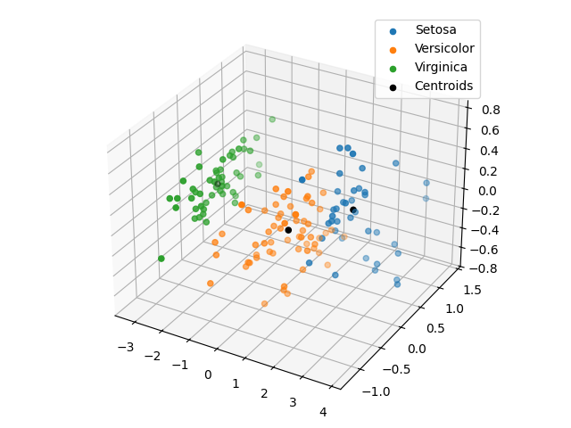
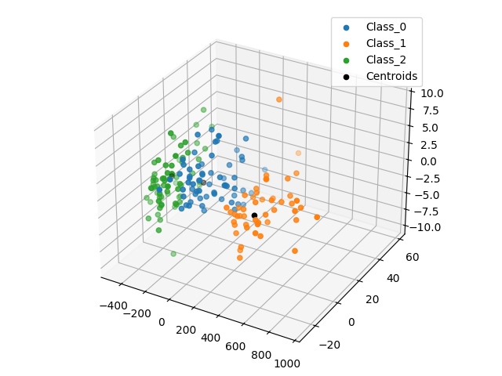

# Agrupamento de Dados com Algoritmo Genético Híbrido (GA + K-Means)

Experimento de **agrupamento não-supervisionado** utilizando um **Algoritmo Genético (AG)** como método de otimização global, acelerado pelo **K-Means** como operador de busca local. O objetivo é encontrar bons agrupamentos em conjuntos de dados clássicos, evoluindo centroides por meio de um AG e refinando-os periodicamente com o K-Means para escapar de mínimos locais de forma mais eficiente.

## Datasets

### Iris

| Propriedade | Valor |
|---|---|
| Amostras | 150 |
| Atributos | 4 (comprimento e largura de sépala e pétala, em cm) |
| Classes | 3 (*Iris setosa*, *Iris versicolor*, *Iris virginica*) |
| Balanceamento | 50 amostras por classe |

### Wine

| Propriedade | Valor |
|---|---|
| Amostras | 178 |
| Atributos | 13 (álcool, ácido málico, cinzas, alcalinidade, magnésio, fenóis, flavonoides, etc.) |
| Classes | 3 (0, 1 e 2) |
| Balanceamento | Levemente desbalanceado (59, 71 e 48 amostras) |

## Implementação

### Representação do Indivíduo (Cromossomo)

Cada indivíduo codifica $k$ centroides concatenados em um vetor de reais:

$$\text{indivíduo} = [c_1^{(1)}, c_1^{(2)}, \ldots, c_1^{(d)},\; c_2^{(1)}, \ldots, c_k^{(d)}]$$

onde $k$ é o número de grupos e $d$ é o número de atributos. A dimensão do espaço de busca é $n\_dim = k \times d$.

O tamanho da população e o número máximo de iterações são derivados automaticamente:

$$\text{size\_pop} = 3 \times n\_dim \qquad \text{max\_iter} = 10 \times n\_dim$$

Os limites de cada gene correspondem ao mínimo e máximo de cada atributo no dataset.

### Operadores Genéticos

- **Seleção**: por torneio
- **Crossover**: aritmético — dado $\alpha \in [0, 1]$ aleatório, os filhos são $\alpha \cdot p_1 + (1-\alpha) \cdot p_2$ e $\alpha \cdot p_2 + (1-\alpha) \cdot p_1$
- **Mutação**: gaussiana com $\mu = 0$ e $\sigma = 0.1$, aplicada com probabilidade 0.01 por gene

### Função de Aptidão

A função objetivo minimizada é a soma das distâncias euclidianas de cada ponto ao seu centroide mais próximo:

$$f(\mathbf{x}) = \sum_{i=1}^{n} \min_{k} \| x_i - c_k \|_2$$

### K-Means como Acelerador de Busca Local

Nas primeiras $\lfloor \text{max\_iter} / 10 \rfloor$ gerações, um indivíduo tem seus centroides refinados pelo K-Means:

- Na **primeira geração**, o melhor indivíduo é refinado.
- Nas **gerações seguintes** (até o limite), um indivíduo aleatório é refinado.

O K-Means é inicializado com os centroides do indivíduo selecionado e executado até convergência. Se o fitness do resultado for melhor, o indivíduo é substituído. Esse mecanismo híbrido combina a exploração global do AG com a intensificação local do K-Means.

## Estrutura do Projeto

```
main.py               # Script de execução via linha de comando
requirements.txt      # Dependências do projeto
clusters/             # Imagens dos clusters gerados (iris.png, wine.png)
notebook/
    clustering.ipynb  # Notebook com documentação e experimentos
src/
    dataset.py        # Wrapper para os datasets
    genetic_algorithm.py  # Implementação do AG híbrido
    runner.py         # Orquestração de múltiplas execuções
```

## Execução

### Pré-requisitos

```bash
pip install -r requirements.txt
```

### Via script

```bash
python main.py
```

O script executa o AG **10 vezes** por dataset, salva os gráficos dos clusters em `clusters/` e imprime uma tabela com as métricas agregadas.

### Via notebook

Abra `notebook/clustering.ipynb` e execute as células sequencialmente.

## Resultados

O AG é executado 10 vezes por dataset. Ao final, são reportadas:

- **Fitness Médio**: média do melhor fitness encontrado em cada execução
- **Desvio Padrão**: variabilidade do fitness entre as execuções
- **Melhor Fitness**: menor valor de fitness obtido em todas as execuções

Os clusters da melhor execução são visualizados em 3D via PCA (necessário pois ambos os datasets têm mais de 3 atributos), com centroides marcados em preto.

### Tabela de Resultados

| Dataset | Fitness Médio | Desvio Padrão | Melhor Fitness |
|---|---|---|---|
| iris | 96.610533 | 0.035556 | 96.559781 |
| wine | 16294.323664 | 0.219202 | 16293.844029 |

### Iris



### Wine



## Dependências Principais

| Biblioteca | Uso |
|---|---|
| `scikit-learn` | Datasets, K-Means e PCA |
| `scikit-opt` | Base `RCGA` para o Algoritmo Genético |
| `numpy` | Operações numéricas |
| `matplotlib` | Visualização dos clusters |
| `pandas` | Tabela de resultados |
